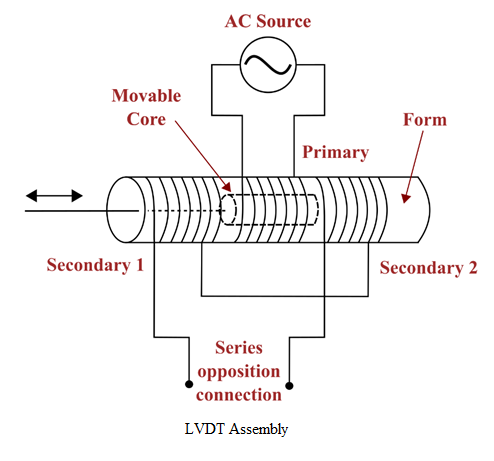
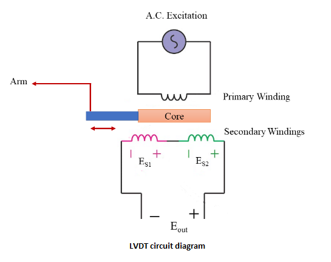

### Procedure

            

**Steps to perform the simuation**

# **Procedure**

1. Connect the circuit according to the provided circuit diagram (Figure 2). The arm is connected to micrometre to measure the displacement of the core.
2. Switch on the power supply to activate the LVDT.
3. Bring the LVDT core to the null position initially. This can be done by adjusting the LVDT nut or control knob until the output voltage is minimized or reaches a balanced state.
4. Rotate the nut clockwise to move the core inward, to the left of the null position. Take the respective voltage readings from the voltmeter.
5. Rotate the nut anticlockwise to move the core towards the right of the null position. Again, record the respective voltage readings from the voltmeter.
6. Based on the recorded voltage readings, plot a graph with core displacement on the x-axis and voltage on the y-axis.
7. Analyse the graph to understand the relationship between displacement and voltage.

            

